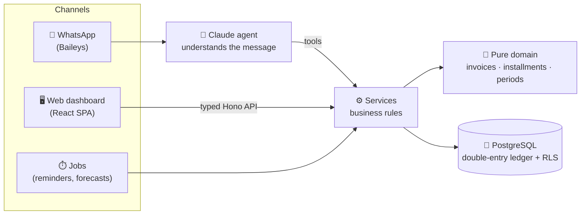

<div align="center">

# 💸 financas

**Personal and household finance, driven from WhatsApp, with a web dashboard that answers the question that matters most each month:**

### *"How much can we still spend?"*

[](docs/product/roadmap.md)
[](https://nodejs.org)
[](https://www.typescriptlang.org)
[](https://pnpm.io)
[](docs/domain/model/README.md)
[](docs/integrations/ai-agent.md)

[Docs](docs/README.md) · [Architecture](docs/architecture/overview.md) · [Data model](docs/domain/model/README.md) · [Decisions](docs/decisions/README.md) · [Roadmap](docs/product/roadmap.md)

</div>

---

> [!NOTE]
> The project is in its **design phase**: the architecture, data model and engineering process are documented, and code comes next. Follow along in the [roadmap](docs/product/roadmap.md).

## Why it exists

Most money goes out on **credit cards**, so the real cost of a month only shows up weeks later on the invoice. **Installments** quietly eat into the following months. When part of the income is **variable** (sales commissions), planning gets even harder.

**financas** is built for people who want to:

- 🎯 **live on fixed income and save the variable part**, knowing every day how much is still free;
- 🔮 **see ahead**: fixed bills, subscriptions and installments projected before they happen;
- ⏰ **never pay late fees**, with reminders before every due date;
- 🤝 **lend their card without chaos**: each person's share stays separate, gets charged over WhatsApp, and is settled when they pay.

## What it feels like

Everything starts with a message (translated here; the product speaks Brazilian Portuguese):

```text
You:  spent 87.50 at the grocery store on the card
Bot:  📝 Groceries · R$ 87.50 · Card X (October invoice) · 1×
      Confirm?
You:  yes
Bot:  ✅ Saved! Still free this month: R$ 1,240.00

You:  dinner 300 on the card, 100 is João's and 100 is Maria's
Bot:  📝 Restaurants · R$ 300.00 · Card X
      • yours: R$ 100.00  • João: R$ 100.00  • Maria: R$ 100.00
      Confirm? I can send them the charge right away.

You:  João paid me back via Pix
Bot:  ✅ Received R$ 100.00 from João. Still open: Maria (R$ 100.00).
```

The web dashboard shows the **period overview** (fixed income, spent, committed, free), **card invoices** split between your spending and other people's, **contacts** with what they owe, **upcoming bills**, and budgets per category.

## Features

| | Feature | Details |
|---|---|---|
| 💬 | **WhatsApp agent** | Records expenses, income, transfers and paybacks in natural language. Always asks before saving |
| 📊 | **Period overview** | Free to spend = fixed income − spent − committed, over a configurable financial month (1st, day N, or N-th business day) |
| 💳 | **Cards and invoices** | Closing and due days per card, installments spread across future invoices, invoice payments never counted as spending twice |
| 🤝 | **Third parties** | Several people per purchase, installments included; charges with a Pix copy-and-paste code; partial payments |
| 🔁 | **Planned vs actual** | Fixed bills, salaries and subscriptions create expected occurrences, matched by real entries |
| ⏰ | **Reminders** | Bills, invoices and charges, with configurable lead time |
| 📎 | **Receipts** | Attach receipts and photos to entries, from WhatsApp too |
| 👥 | **Workspaces** | Isolated spaces ("Home", "Personal") with members and module-level permissions |

## How it works



**Three entry points, one path to the data.** An expense recorded from the dashboard, from WhatsApp or by a job goes through exactly the same rules.

## Principles

- **🧠 The AI interprets; the code computes.** The model only understands the message and picks a tool. Totals, invoice dates and installments are deterministic, tested functions. The AI never writes to the database.
- **📒 Double-entry ledger.** Every entry has lines that sum to zero, **enforced by the database**. Paying an invoice is never counted as spending, and other people's shares never mix with yours.
- **🏢 Multi-tenant from day one.** Every workspace is isolated by composite keys and Postgres *Row Level Security*, with module × action permissions inside it.
- **🗑️ Nothing is lost.** Soft delete with a restorable trash, and edits keep the previous version.
- **🪶 Lightweight on purpose.** One Node process and one Postgres, built to run on a modest home server.
- **🔭 Observable and debuggable.** Structured logs, OpenTelemetry ready to grow, and a reference code on every error that leads straight to what happened.

## Stack

| Layer | Technology |
|---|---|
| Runtime | Node.js 24 LTS · TypeScript (strict) · pnpm workspaces |
| API | [Hono](https://hono.dev) with a typed RPC client · Zod |
| Database | PostgreSQL · [Drizzle ORM](https://orm.drizzle.team) · Row Level Security |
| WhatsApp | [Baileys](https://github.com/WhiskeySockets/Baileys) |
| AI | [Claude](https://www.anthropic.com/claude) via `@anthropic-ai/sdk` (Tool Runner) |
| Web | Vite · React 19 · Tailwind CSS v4 · shadcn/ui · TanStack Router/Query · PWA |
| Quality | Vitest · Biome · dependency-cruiser · lefthook + commitlint |
| Operations | Docker · GitHub Actions → GHCR → Dokploy · OpenTelemetry · Netdata · Uptime Kuma |

## Repository layout

```text
financas/
├── apps/
│   ├── api/        # Hono + WhatsApp + agent + jobs (one process)
│   └── web/        # React SPA (served by the API)
├── packages/
│   └── shared/     # Zod schemas and pure domain rules
└── docs/           # product, domain, architecture, engineering, operations, ADRs
```

## Documentation

The docs are written to be read by people **and by AI agents**: every file starts with a header saying when to read it, and [`docs/README.md`](docs/README.md) is the index.

| Area | Start with |
|---|---|
| Product | [Vision](docs/product/vision.md) · [Roadmap](docs/product/roadmap.md) |
| Domain | [Glossary](docs/domain/glossary.md) · [Data model](docs/domain/model/README.md) · [Diagrams](docs/domain/model/diagrams.md) · [Invoices and installments](docs/domain/billing-and-installments.md) |
| Architecture | [Overview](docs/architecture/overview.md) · [Structure](docs/architecture/structure.md) · [Dependency rules](docs/architecture/dependency-rules.md) |
| Engineering | [Git and PRs](docs/engineering/git-workflow.md) · [CI/CD](docs/engineering/ci-cd.md) · [Working with Claude](docs/engineering/claude-workflow.md) |
| Operations | [Observability](docs/operations/observability.md) · [Runbook](docs/operations/runbook.md) · [Deploy](docs/operations/deploy.md) |
| Decisions | [ADRs](docs/decisions/README.md) |

## Roadmap

- [x] Architecture, stack and engineering process
- [x] Data model: double-entry ledger, multi-tenancy, permissions, third parties, planning
- [ ] Monorepo skeleton, schema and migrations
- [ ] **MVP**: WhatsApp agent, dashboard, cards, third parties, reminders
- [ ] Voice notes and receipt photos on WhatsApp
- [ ] Bank statement and invoice import

Details in [`docs/product/roadmap.md`](docs/product/roadmap.md).

## Contributing

The project follows [Conventional Commits](https://www.conventionalcommits.org/), trunk-based development with PRs and squash merges, and records every architectural decision as an [ADR](docs/decisions/README.md). See [`docs/engineering/git-workflow.md`](docs/engineering/git-workflow.md).

<div align="center">

<sub>Built with <a href="https://claude.com/claude-code">Claude Code</a> 🧡</sub>

</div>
