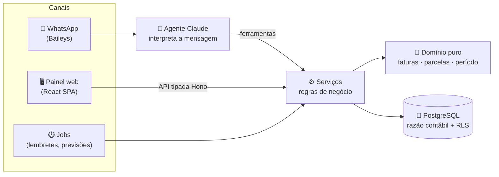

<div align="center">

# 💸 financas

**Controle financeiro pessoal e do casal, direto pelo WhatsApp, com um painel web que responde a pergunta mais importante do mês:**

### *"Quanto ainda podemos gastar?"*

[](docs/product/roadmap.md)
[](https://nodejs.org)
[](https://www.typescriptlang.org)
[](https://pnpm.io)
[](docs/domain/model/README.md)
[](docs/integrations/ai-agent.md)

[Documentação](docs/README.md) · [Arquitetura](docs/architecture/overview.md) · [Modelo de dados](docs/domain/model/README.md) · [Decisões](docs/decisions/README.md) · [Roadmap](docs/product/roadmap.md)

</div>

---

> [!NOTE]
> O projeto está em **fase de design**: arquitetura, modelo de dados e processo de engenharia já estão documentados, e o código começa em seguida. Acompanhe pelo [roadmap](docs/product/roadmap.md).

## Por que existe

A maior parte do dinheiro sai no **cartão de crédito**, então o custo real do mês só aparece semanas depois, na fatura. As **parcelas** comem os meses seguintes sem ninguém perceber. Quando parte da renda é **variável** (comissões), planejar fica ainda mais difícil.

O **financas** foi feito para quem quer:

- 🎯 **viver com a renda fixa e guardar a variável**, sabendo a cada dia quanto ainda está livre;
- 🔮 **enxergar o futuro**: contas fixas, assinaturas e parcelas projetadas antes de acontecer;
- ⏰ **nunca pagar juros por atraso**, com lembretes antes de cada vencimento;
- 🤝 **emprestar o cartão sem virar bagunça**: a parte de cada pessoa fica separada, é cobrada pelo WhatsApp e baixada quando ela paga.

## Como é usar

Tudo começa com uma mensagem:

```text
Você:  gastei 87,50 no mercado no cartão
Bot:   📝 Mercado · R$ 87,50 · Cartão X (fatura de outubro) · 1×
       Confirma?
Você:  sim
Bot:   ✅ Lançado! Ainda livre este mês: R$ 1.240,00

Você:  jantar 300 no cartão, 100 é do João e 100 da Maria
Bot:   📝 Restaurantes · R$ 300,00 · Cartão X
       • seu: R$ 100,00  • João: R$ 100,00  • Maria: R$ 100,00
       Confirma? Posso já mandar a cobrança para eles.

Você:  o João me pagou no pix
Bot:   ✅ Recebido R$ 100,00 do João. Falta: Maria (R$ 100,00).
```

No painel web ficam o **resumo do período** (renda fixa, gasto, comprometido e livre), as **faturas** separando o que é seu do que é de terceiros, os **contatos** com saldo a receber, as **contas a vencer** e o orçamento por categoria.

## Funcionalidades

| | Recurso | Detalhes |
|---|---|---|
| 💬 | **Agente no WhatsApp** | Lança gastos, receitas, transferências e pagamentos de terceiros em linguagem natural. Sempre pede confirmação antes de gravar |
| 📊 | **Resumo do período** | Livre para gastar = renda fixa − gasto − comprometido, com o mês financeiro configurável (dia 1, dia N ou N-ésimo dia útil) |
| 💳 | **Cartões e faturas** | Fechamento e vencimento por cartão, parcelas distribuídas nas faturas futuras, pagamento de fatura sem contar o gasto duas vezes |
| 🤝 | **Terceiros** | Várias pessoas por compra, inclusive parceladas; cobrança com Pix copia-e-cola; pagamentos parciais |
| 🔁 | **Previsto × realizado** | Contas fixas, salários e assinaturas geram previsões que são baixadas pelos lançamentos reais |
| ⏰ | **Lembretes** | Contas, faturas e cobranças, com antecedência configurável |
| 📎 | **Comprovantes** | Anexe notas e fotos aos lançamentos, também pelo WhatsApp |
| 👥 | **Espaços** | Crie espaços isolados ("Casa", "Pessoal") e convide pessoas com papéis diferentes |

## Como funciona



**Três portas de entrada, um só caminho até os dados.** Um gasto lançado pelo painel, pelo WhatsApp ou por um job passa exatamente pelas mesmas regras.

## Princípios

- **🧠 A IA interpreta, o código calcula.** O modelo só entende a mensagem e escolhe uma ferramenta. Contas, datas de fatura e parcelas são funções determinísticas e testadas. A IA nunca escreve no banco.
- **📒 Razão contábil de partidas dobradas.** Todo lançamento tem linhas que somam zero, **garantido pelo banco**. Pagar a fatura não conta como gasto, e a parte de terceiros não se mistura com a sua.
- **🏢 Multiusuário desde o primeiro dia.** Cada espaço é isolado por chaves compostas e *Row Level Security* no Postgres.
- **🪶 Leve de propósito.** Um único processo Node e um Postgres, pensado para rodar num servidor doméstico modesto.
- **🔭 Observável e depurável.** Logs estruturados, OpenTelemetry pronto para evoluir e um código de referência em cada erro que leva direto ao que aconteceu.

## Stack

| Camada | Tecnologia |
|---|---|
| Runtime | Node.js 24 LTS · TypeScript (strict) · pnpm workspaces |
| API | [Hono](https://hono.dev) com cliente RPC tipado · Zod |
| Banco | PostgreSQL · [Drizzle ORM](https://orm.drizzle.team) · Row Level Security |
| WhatsApp | [Baileys](https://github.com/WhiskeySockets/Baileys) |
| IA | [Claude](https://www.anthropic.com/claude) via `@anthropic-ai/sdk` (Tool Runner) |
| Web | Vite · React 19 · Tailwind CSS v4 · shadcn/ui · TanStack Router/Query · PWA |
| Qualidade | Vitest · Biome · dependency-cruiser · lefthook + commitlint |
| Operação | Docker · GitHub Actions → GHCR → Dokploy · OpenTelemetry · Netdata · Uptime Kuma |

## Estrutura

```text
financas/
├── apps/
│   ├── api/        # Hono + WhatsApp + agente + jobs (um processo)
│   └── web/        # SPA React (servida pela API)
├── packages/
│   └── shared/     # schemas Zod e regras de domínio puras
└── docs/           # produto, domínio, arquitetura, engenharia, operação, ADRs
```

## Documentação

A documentação é escrita para ser lida por pessoas **e por agentes de IA**: cada arquivo tem um cabeçalho dizendo quando lê-lo, e [`docs/README.md`](docs/README.md) funciona como índice.

| Área | Comece por |
|---|---|
| Produto | [Visão](docs/product/vision.md) · [Roadmap](docs/product/roadmap.md) |
| Domínio | [Glossário](docs/domain/glossary.md) · [Modelo de dados](docs/domain/model/README.md) · [Faturas e parcelas](docs/domain/billing-and-installments.md) |
| Arquitetura | [Visão geral](docs/architecture/overview.md) · [Estrutura](docs/architecture/structure.md) · [Regras de dependência](docs/architecture/dependency-rules.md) |
| Engenharia | [Git e PRs](docs/engineering/git-workflow.md) · [CI/CD](docs/engineering/ci-cd.md) · [Fluxo com Claude](docs/engineering/claude-workflow.md) |
| Operação | [Observabilidade](docs/operations/observability.md) · [Runbook](docs/operations/runbook.md) · [Deploy](docs/operations/deploy.md) |
| Decisões | [ADRs](docs/decisions/README.md) |

## Roadmap

- [x] Arquitetura, stack e processo de engenharia
- [x] Modelo de dados: razão contábil, multi-tenant, terceiros e planejamento
- [ ] Esqueleto do monorepo, schema e migrations
- [ ] **MVP**: agente no WhatsApp, painel, cartões, terceiros, lembretes
- [ ] Áudio e foto de comprovante no WhatsApp
- [ ] Importação de extratos e faturas

Detalhes em [`docs/product/roadmap.md`](docs/product/roadmap.md).

## Contribuindo

O projeto segue [Conventional Commits](https://www.conventionalcommits.org/pt-br/), desenvolvimento *trunk-based* com PRs e *squash merge*, e registra toda decisão de arquitetura como um [ADR](docs/decisions/README.md). Veja [`docs/engineering/git-workflow.md`](docs/engineering/git-workflow.md).

<div align="center">

<sub>Desenvolvido com <a href="https://claude.com/claude-code">Claude Code</a> 🧡</sub>

</div>
