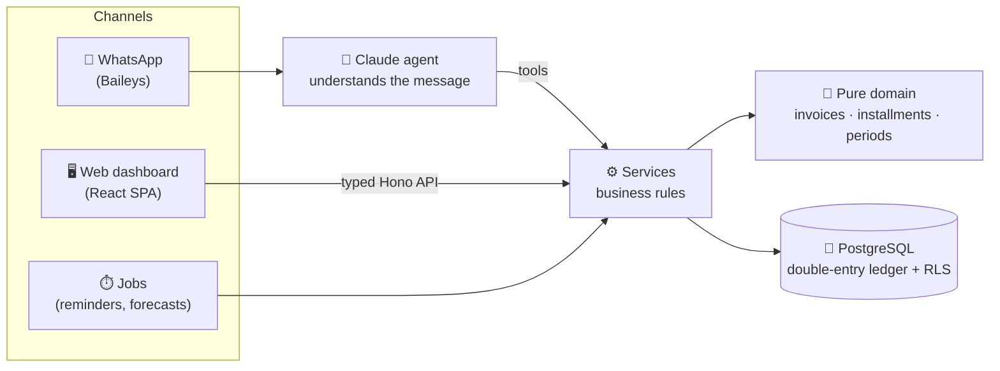

<div align="center">

# 💸 Twise

### *Light, clear, together.*

**Clear for both of you, light on the pocket: the app that shows how much you can still spend this month.**

Household finance for couples, with a web dashboard and (soon) a WhatsApp assistant.

[](docs/product/roadmap.md)
[](https://nodejs.org)
[](https://www.typescriptlang.org)
[](https://pnpm.io)
[](docs/domain/model/README.md)
[](docs/integrations/ai-agent.md)

[Docs](docs/README.md) · [Architecture](docs/architecture/overview.md) · [Data model](docs/domain/model/README.md) · [Decisions](docs/decisions/README.md) · [Roadmap](docs/product/roadmap.md)

</div>

---

> [!NOTE]
> **The backend is done and running in production** on a home server: ledger, cards and invoices, shared purchases and charges, planning, dashboard metrics and alerts, reminders, attachments and an audit log, all behind a typed HTTP API ([Postman collection](docs/api/postman.md)).
> **Next:** the web app, whose [requirements](docs/product/requirements/README.md) are written screen by screen, and then the WhatsApp channel with the Claude agent. Follow along in the [roadmap](docs/product/roadmap.md).

## Why it exists

Most money goes out on **credit cards**, so the real cost of a month only shows up weeks later on the invoice. **Installments** quietly eat into the following months. When part of the income is **variable** (sales commissions), planning gets even harder.

**Twise** is built for couples who want to:

- 🎯 **live on fixed income and save the variable part**, knowing every day how much is still free;
- 🔮 **see ahead**: fixed bills, subscriptions and installments projected before they happen;
- ⏰ **never pay late fees**, with reminders before every due date;
- 🤝 **lend their card without chaos**: each person's share stays separate, gets charged over WhatsApp, and is settled when they pay.

## What it feels like

Everything starts with a message (translated here; the product speaks Brazilian Portuguese):

```text
You:  spent 87.50 at the grocery store on the card
Bot:  📝 Groceries · R$ 87.50 · Card X (October invoice) · 1×
      Confirm?
You:  yes
Bot:  ✅ Saved! Still free this month: R$ 1,240.00

You:  dinner 300 on the card, 100 is João's and 100 is Maria's
Bot:  📝 Restaurants · R$ 300.00 · Card X
      • yours: R$ 100.00  • João: R$ 100.00  • Maria: R$ 100.00
      Confirm? I can send them the charge right away.

You:  João paid me back via Pix
Bot:  ✅ Received R$ 100.00 from João. Still open: Maria (R$ 100.00).
```

*(The WhatsApp agent is the last phase; the rules it will call already exist in the API.)*

The web dashboard shows the **period overview** (fixed income, spent, committed, free), **card invoices** split between your spending and other people's, **contacts** with what they owe, **upcoming bills**, and budgets per category.

## Features

| | Feature | Details | Status |
|---|---|---|---|
| 📊 | **Period overview** | Free to spend = fixed income − spent − committed, per day, over a configurable financial month (1st, day N, or N-th business day) | ✅ API |
| 🚨 | **Alerts** | Budget over or ahead of pace, balance going negative, bills overdue, commission not yet split, contacts overdue | ✅ API |
| 🛒 | **"Can I afford it?"** | Simulates a purchase (in installments too) and shows its effect month by month | ✅ API |
| 💳 | **Cards and invoices** | Closing and due days per card, installments spread across future invoices, invoice payments never counted as spending twice | ✅ API |
| 🤝 | **Third parties** | Several people per purchase, installments included; charges with the pt-BR message and a Pix copy-and-paste code; partial payments | ✅ API · sending by WhatsApp next |
| 🔁 | **Planned vs actual** | Fixed bills, salaries and subscriptions create expected occurrences, matched by real entries; budgets and goals | ✅ API |
| 💰 | **Commission split** | Configurable steps (reserve, goals, spending) that suggest where a variable income goes | ✅ API |
| ⏰ | **Reminders** | Bills and invoices, by each member's lead time and quiet hours | ✅ email · WhatsApp next |
| 📎 | **Receipts** | Attach receipts to entries and charges | ✅ API · WhatsApp photos next |
| 👥 | **Workspaces** | Isolated spaces ("Home", "Personal") with members, invitations and module-level permissions | ✅ API |
| 🕵️ | **History** | Append-only audit log of every change, with who, when and from where | ✅ API |
| 🖥️ | **Web app** | Mobile-first dashboard for the couple | 🔜 next |
| 💬 | **WhatsApp agent** | Records expenses, income, transfers and paybacks in natural language. Always asks before saving | 🔜 after the web |

## How it works


```mermaid
flowchart LR
    subgraph Channels
        WA["📱 WhatsApp<br/>(Baileys)"]
        WEB["🖥️ Web dashboard<br/>(React SPA)"]
        JOBS["⏱️ Jobs<br/>(reminders, forecasts)"]
    end

    WA --> AGENT["🤖 Claude agent<br/>understands the message"]
    AGENT -->|tools| SVC
    WEB -->|typed Hono API| SVC
    JOBS --> SVC

    SVC["⚙️ Services<br/>business rules"] --> DOMAIN["🧮 Pure domain<br/>invoices · installments · periods"]
    SVC --> DB[("🐘 PostgreSQL<br/>double-entry ledger + RLS")]
```

**Three entry points, one path to the data.** An expense recorded from the dashboard, from WhatsApp or by a job goes through exactly the same rules.

## Principles

- **🧠 The AI interprets; the code computes.** The model only understands the message and picks a tool. Totals, invoice dates and installments are deterministic, tested functions. The AI never writes to the database.
- **📒 Double-entry ledger.** Every entry has lines that sum to zero, **enforced by the database**. Paying an invoice is never counted as spending, and other people's shares never mix with yours.
- **🏢 Multi-tenant from day one.** Every workspace is isolated by composite keys and Postgres *Row Level Security*, with module × action permissions inside it.
- **🗑️ Nothing is lost.** Soft delete with a restorable trash, and edits keep the previous version.
- **🪶 Lightweight on purpose.** One Node process and one Postgres, built to run on a modest home server.
- **🔭 Observable and debuggable.** Structured logs, OpenTelemetry ready to grow, and a reference code on every error that leads straight to what happened.

## Stack

| Layer | Technology |
|---|---|
| Runtime | Node.js 24 LTS · TypeScript (strict) · pnpm workspaces |
| API | [Hono](https://hono.dev) with a typed RPC client · Zod |
| Database | PostgreSQL · [Drizzle ORM](https://orm.drizzle.team) · Row Level Security |
| WhatsApp | [Baileys](https://github.com/WhiskeySockets/Baileys) |
| AI | [Claude](https://www.anthropic.com/claude) via `@anthropic-ai/sdk` (Tool Runner) |
| Web | Vite · React 19 · Tailwind CSS v4 · shadcn/ui · TanStack Router/Query · PWA |
| Quality | Vitest · Biome · dependency-cruiser · lefthook + commitlint |
| Operations | Docker · GitHub Actions → GHCR → Dokploy · OpenTelemetry · Netdata · Uptime Kuma |

## Repository layout

The code name is `financas`: it names the repository, the packages (`@financas/*`) and the services.

```text
financas/
├── apps/
│   ├── api/        # Hono API + jobs (+ WhatsApp and agent later), one process; Drizzle migrations
│   └── web/        # React SPA, served by the API (next)
├── packages/
│   └── shared/     # Zod schemas and pure domain rules, grouped by area (ledger, planning, reports…)
├── scripts/        # quality checks and ops:* helpers (health, logs, trace, errors, metrics, jobs)
└── docs/           # product, requirements, domain, architecture, engineering, operations, ADRs, API
```

## Running it locally

Needs Node.js 24, pnpm and Docker (for the local Postgres).

```bash
pnpm install              # dependencies + git hooks
cp .env.example .env      # once; the defaults work for development
pnpm db:up                # Postgres 18 on 127.0.0.1:5433
pnpm db:migrate           # apply the migrations
pnpm ops:create-user      # first user and workspace (asks for the password without echo)
pnpm dev                  # API on :3100 + web (Vite, proxies /api)
```

| Command | Does |
|---|---|
| `pnpm check` | Lint, no comments, file roles, typecheck, dependency rules, unit tests, docs links |
| `pnpm test:integration` | Database tests (RLS, ledger invariants, every route) |
| `pnpm build` | Web build + API bundle |

The API can be explored with the [Postman collection](docs/api/postman.md). Deploying on your own server: [`docs/operations/deploy.md`](docs/operations/deploy.md).

## Documentation

The docs are written to be read by people **and by AI agents**: every file starts with a header saying when to read it, and [`docs/README.md`](docs/README.md) is the index.

| Area | Start with |
|---|---|
| Product | [Vision](docs/product/vision.md) · [Roadmap](docs/product/roadmap.md) · [Web requirements](docs/product/requirements/README.md) |
| Domain | [Glossary](docs/domain/glossary.md) · [Data model](docs/domain/model/README.md) · [Diagrams](docs/domain/model/diagrams.md) · [Invoices and installments](docs/domain/billing-and-installments.md) |
| Architecture | [Overview](docs/architecture/overview.md) · [Structure](docs/architecture/structure.md) · [Dependency rules](docs/architecture/dependency-rules.md) |
| Engineering | [Git and PRs](docs/engineering/git-workflow.md) · [CI/CD](docs/engineering/ci-cd.md) · [Working with Claude](docs/engineering/claude-workflow.md) |
| Operations | [Observability](docs/operations/observability.md) · [Runbook](docs/operations/runbook.md) · [Deploy](docs/operations/deploy.md) |
| API | [Postman collection](docs/api/postman.md) · [Error codes and messages](docs/product/requirements/error-messages.md) |
| Decisions | [ADRs](docs/decisions/README.md) |

## Roadmap

- [x] Architecture, stack and engineering process
- [x] Data model: double-entry ledger, multi-tenancy, permissions, third parties, planning
- [x] Monorepo, schema and migrations, CI with quality gates
- [x] Backend: auth, workspaces, ledger, cards, contacts and charges, planning, dashboard metrics and alerts, reminders, attachments, audit log
- [x] Observability, Docker image, deploy on Dokploy, daily backups
- [x] Web requirements: experience, UI standards, design system brief, every screen
- [ ] **Web app**: design system, then screen by screen
- [ ] **WhatsApp channel and Claude agent**
- [ ] Voice notes and receipt photos on WhatsApp
- [ ] Bank statement and invoice import

Details in [`docs/product/roadmap.md`](docs/product/roadmap.md).

## Contributing

The project follows [Conventional Commits](https://www.conventionalcommits.org/), trunk-based development with PRs and squash merges, and records every architectural decision as an [ADR](docs/decisions/README.md). See [`docs/engineering/git-workflow.md`](docs/engineering/git-workflow.md).

<div align="center">

<sub>Built with <a href="https://claude.com/claude-code">Claude Code</a> 🧡</sub>

</div>
