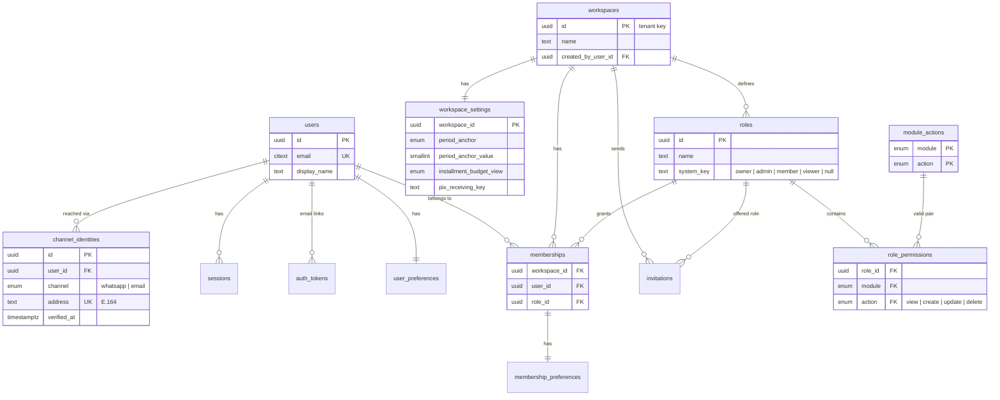
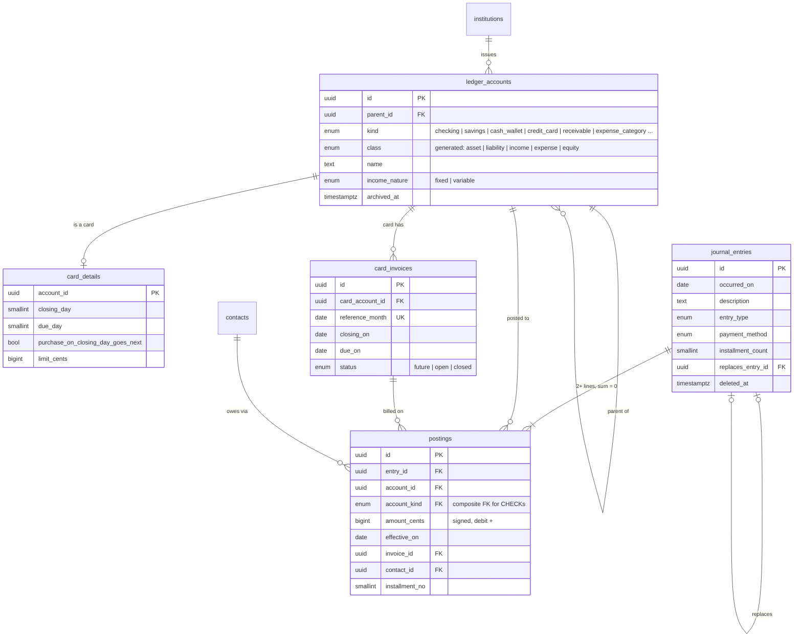
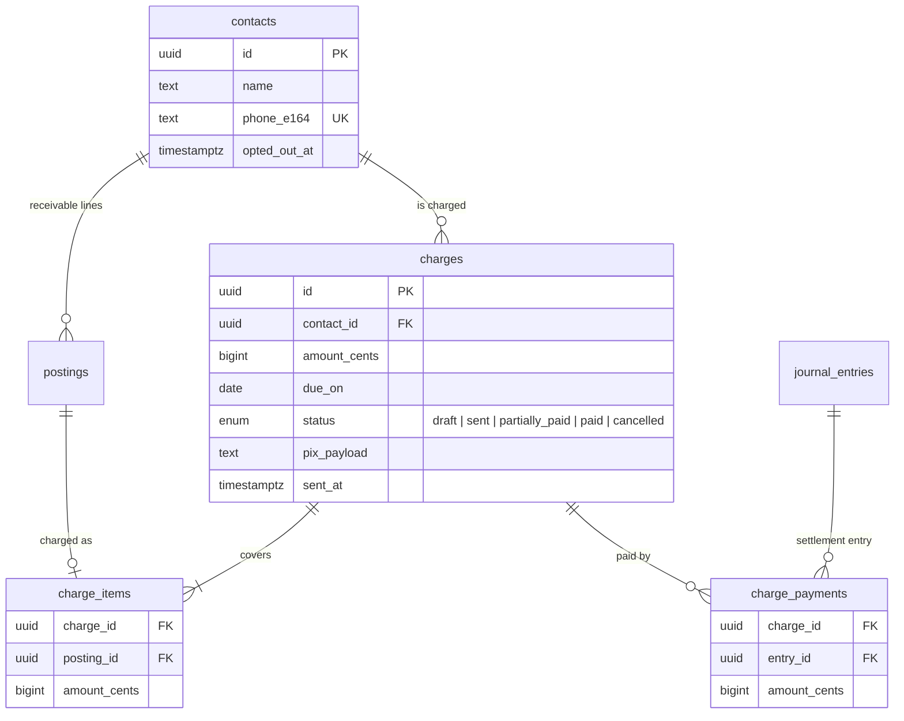
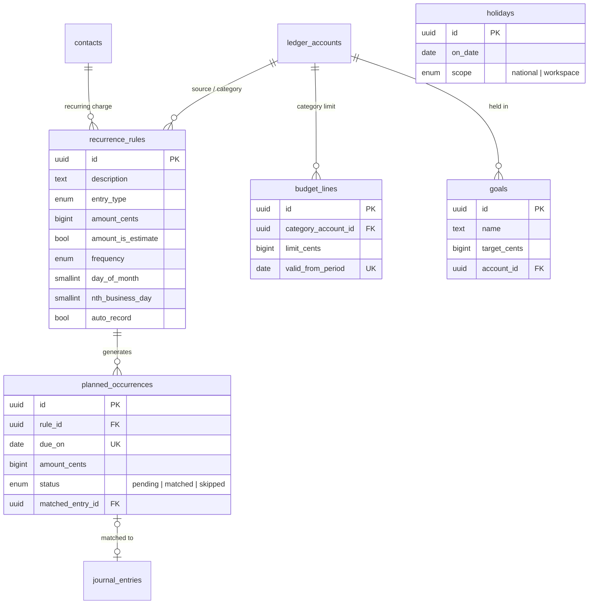
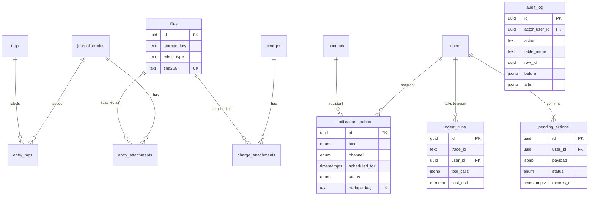

# Model diagrams

Key columns only. Every tenant table also has `workspace_id` (composite FKs), `created_at`,
`updated_at`, and, where user-facing, `deleted_at` / `deleted_by_user_id`. Those are omitted to keep
the diagrams readable. Full columns: the area docs linked in each section.

## 1. Tenancy and access (`tenancy.md`, `access-control.md`)

## 2. Ledger (`ledger.md`)

## 3. Third parties (`third-parties.md`)

## 4. Planning (`planning.md`)

## 5. Support (`support.md`)

